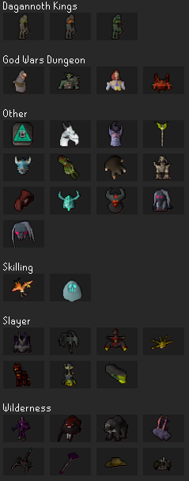
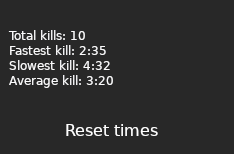

## Introduction
Currently, there is no plugin that maintains a record of all the kill times for a given boss. The goal of this plugin is to track all boss times for a given boss and provide the player with statistics.

## Design Mockup
  
Here the user can select a boss they want to see statistics on. Once they select the boss it will bring them to the next screen.

  
This is an example for the data that will be displayed after selecting a boss. The reset button allows the user to reset all of the boss times for selected boss. 

