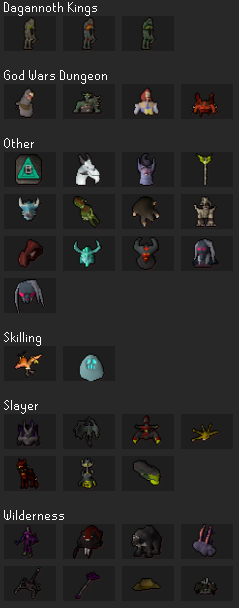
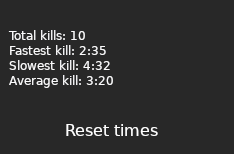

## Introduction
Currently, there is no plugin that maintains a record of all the kill times for a given boss. The goal of this plugin is to track all boss times for a given boss and provide the player with statistics.

##Features
### View a List of Time Trackable Bosses
The plugins displays a list of time trackable bosses. There should be an image of the boss and the bosses name in the panel. 
### View Boss Stats
The plugins displays the stats of the boss as shown in the Design Mockup. If there is no recorded stats then an error message will be displayed.
### Track Kill Time
The plugin tracks the kill time after a boss is defeated and stores it in a JSON file locally.
### Reset Time
The plugin has the abillity to reset either the slowest, fastest, or all times.

## Design Mockup
  
Here the user can select a boss they want to see statistics on. Once they select the boss it will bring them to the next screen.

  
This is an example for the data that will be displayed after selecting a boss. The reset button allows the user to reset all of the boss times for selected boss. 

## Installation
Coming soon...
